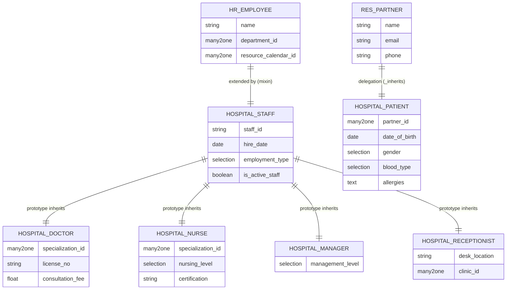
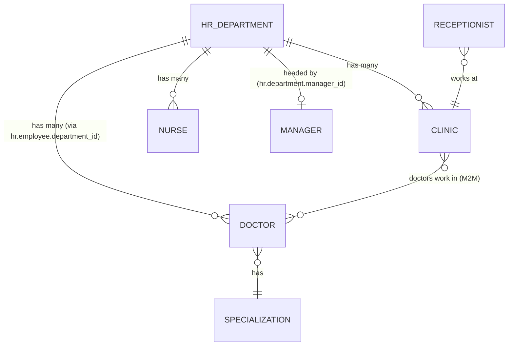
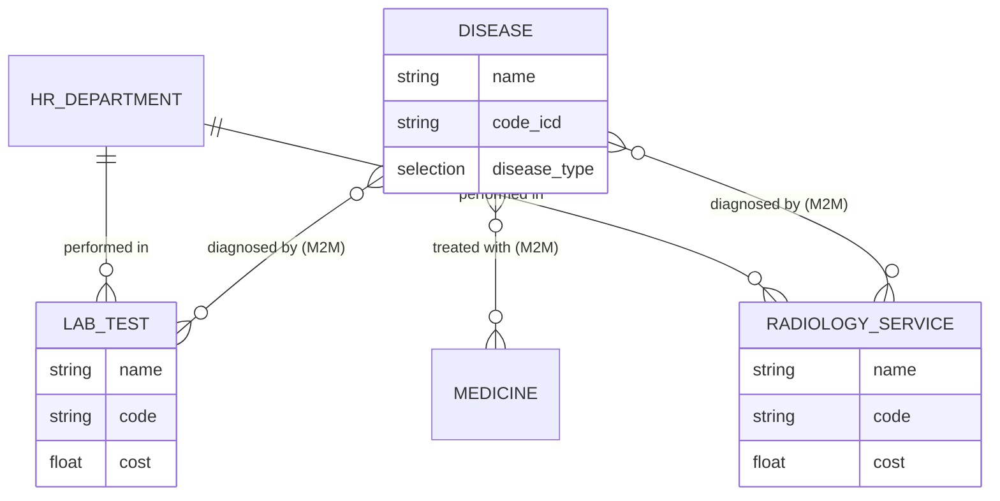
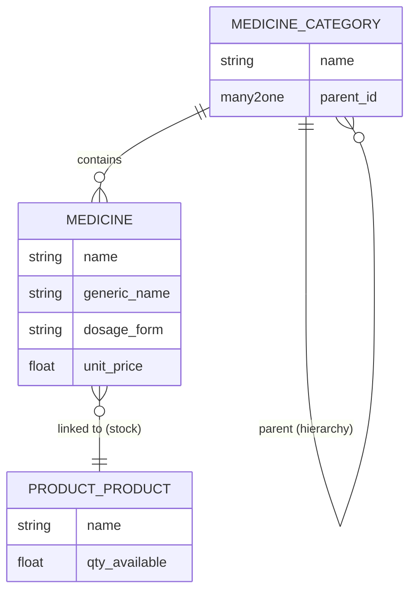
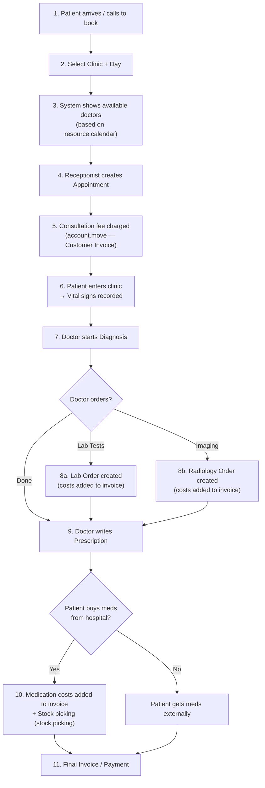
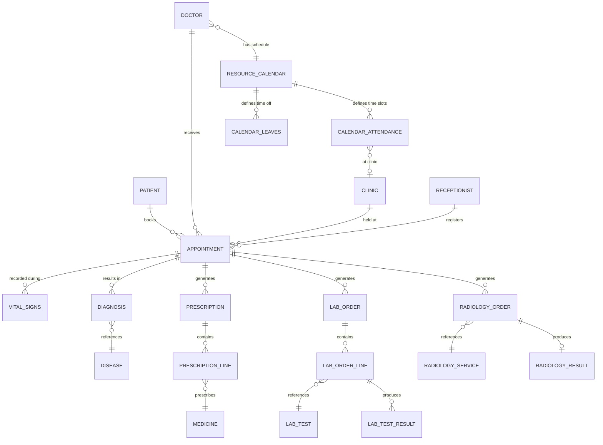
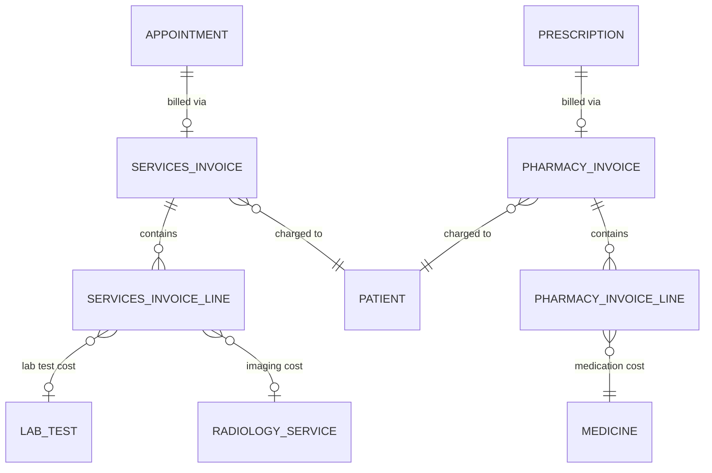
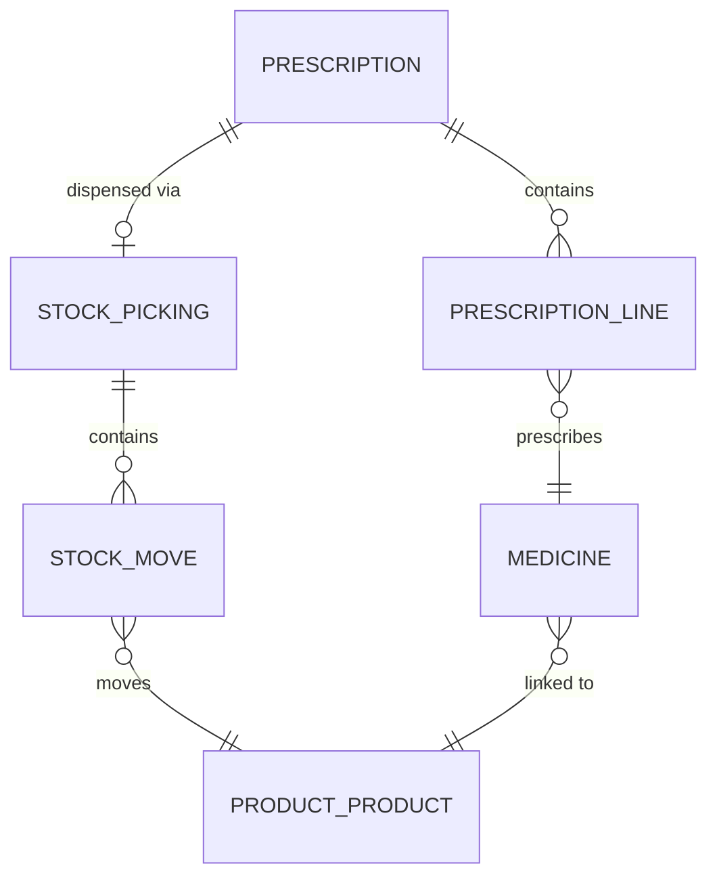

# 🏥 Hospital Management System — System Design (Simplified)

> **Module**: `nthub_hospital` (Odoo 19)
> **Scope**: Outpatient Clinic Workflow
> **Goal**: Learn to work with Odoo's standard modules (`account`, `stock`, `hr`)

---

## 1. People Models

### 1.1 Staff — Prototype Inheritance from `hospital.staff` Mixin

All staff members share a common mixin model `hospital.staff` which **extends** `hr.employee` (class inheritance). Each role then uses **prototype inheritance** to create its own model/table.

```
hr.employee (Odoo built-in)
  └── hospital.staff (mixin, _inherit = 'hr.employee')
        │   Adds: staff_id (Char), hire_date (Date),
        │         employment_type (Selection), is_active_staff (Boolean)
        │         (reuses hr.employee's built-in department_id → hr.department)
        │
        ├── hospital.doctor   (_name = 'hospital.doctor',   _inherit = 'hospital.staff')
        │     specialization_id (M2O), license_no, consultation_fee, clinic_ids (M2M)
        │
        ├── hospital.nurse    (_name = 'hospital.nurse',    _inherit = 'hospital.staff')
        │     specialization_id (M2O), nursing_level (Selection), certification (Char)
        │
        ├── hospital.manager  (_name = 'hospital.manager',  _inherit = 'hospital.staff')
        │     management_level (Selection)
        │
        └── hospital.receptionist (_name = 'hospital.receptionist', _inherit = 'hospital.staff')
              desk_location (Char), clinic_id (M2O → hospital.clinic)
```

| Model | `_name` | `_inherit` | Inherits From | New Table? |
|---|---|---|---|---|
| Staff Mixin | *(none — extends `hr.employee`)* | `hr.employee` | — | No (adds columns to `hr_employee`) |
| Doctor | `hospital.doctor` | `hospital.staff` | `hr.employee` fields | ✅ Yes |
| Nurse | `hospital.nurse` | `hospital.staff` | `hr.employee` fields | ✅ Yes |
| Manager | `hospital.manager` | `hospital.staff` | `hr.employee` fields | ✅ Yes |
| Receptionist | `hospital.receptionist` | `hospital.staff` | `hr.employee` fields | ✅ Yes |

> [!IMPORTANT]
> The `hospital.staff` mixin does NOT define its own `_name`. It simply adds shared hospital-specific fields to `hr.employee`. Each role model then inherits those fields via prototype inheritance into its own table.

### 1.2 Patient — Delegation Inheritance from `res.partner`

```
res.partner (Odoo built-in)
  └── hospital.patient (_name = 'hospital.patient', _inherits = {'res.partner': 'partner_id'})
        partner_id (M2O → res.partner)
        date_of_birth, gender, blood_type, marital_status,
        emergency_contact_name, emergency_contact_phone,
        allergies (Text), chronic_conditions (Text),
        medical_notes (Html)
```

| Model | `_name` | `_inherits` | New Table? | Notes |
|---|---|---|---|---|
| Patient | `hospital.patient` | `{'res.partner': 'partner_id'}` | ✅ Yes | Each patient auto-creates a `res.partner` record |

> [!NOTE]
> Medical history fields (allergies, chronic conditions, blood type) live directly on the `hospital.patient` model — no separate EMR model needed.

### 1.3 People — Entity Relationships



---

## 2. Facilities — Clinic Workflow Only

Only the models needed for the outpatient clinic workflow are kept.

### 2.1 Models

| Model | `_name` / `_inherit` | Purpose | Key Fields |
|---|---|---|---|
| Department | `_inherit = 'hr.department'` | Extends Odoo's built-in department with hospital fields | `code`, `is_clinical` (Boolean), `location` — inherits `name`, `manager_id`, `company_id` from `hr.department` |
| Clinic | `hospital.clinic` | Physical clinic where consultations happen | `name`, `department_id` (M2O → `hr.department`), `location`, `capacity`, `is_active` |
| Specialization | `hospital.specialization` | Medical specializations catalog | `name`, `code`, `description` |

> [!NOTE]
> **Department** is not a new model — it extends `hr.department` via `_inherit`. This means every staff member's existing `department_id` field (from `hr.employee`) points to the same model, with no field conflicts. All HR features (payroll, leaves, org chart) work out of the box.

### 2.2 Relationships



> [!NOTE]
> **Removed models**: `hospital.room`, `hospital.bed`, `hospital.operating.theater` — these are no longer in scope.

---

## 3. Medical Reference Data

### 3.1 Models

| Model | `_name` | Purpose | Key Fields |
|---|---|---|---|
| Disease | `hospital.disease` | Disease/condition catalog | `name`, `code` (ICD), `description`, `disease_type` |
| Lab Test | `hospital.lab.test` | Laboratory test catalog | `name`, `code`, `cost`, `department_id` (M2O → `hr.department`), `description`, `turnaround_time` |
| Radiology Service | `hospital.radiology.service` | Radiology/imaging service catalog | `name`, `code`, `cost`, `department_id` (M2O → `hr.department`), `description` |

### 3.2 Pharmacy / Medication Models

| Model | `_name` | Purpose | Key Fields |
|---|---|---|---|
| Medicine Category | `hospital.medicine.category` | Categorization of medicines | `name`, `description`, `parent_id` (self-referencing for hierarchy) |
| Medicine | `hospital.medicine` | Medicine catalog (links to `product.product` for stock) | `name`, `generic_name`, `category_id`, `dosage_form`, `strength`, `unit_price`, `product_id` (M2O → `product.product`) |

### 3.3 Disease & Diagnostic Relationships



### 3.4 Pharmacy & Stock Relationships



---

## 4. Core Workflow — Outpatient Clinic Visit

This is the main workflow of the system. Every transactional model follows Odoo's state machine pattern.

### 4.1 Workflow Overview



### 4.2 Transactional Models

#### Appointment

| Field | Type | Notes |
|---|---|---|
| `patient_id` | M2O → `hospital.patient` | Required |
| `doctor_id` | M2O → `hospital.doctor` | Required |
| `clinic_id` | M2O → `hospital.clinic` | Required |
| `appointment_date` | Date | Selected by patient |
| `appointment_time` | Float | Time slot |
| `state` | Selection | `draft` → `confirmed` → `in_progress` → `completed` → `cancelled` |
| `is_walkin` | Boolean | Walk-in patient flag |
| `notes` | Text | Additional notes |
| `receptionist_id` | M2O → `hospital.receptionist` | Who registered it |

**State Flow:**
```
draft → confirmed → in_progress → completed
                 ↘ cancelled
```

#### Vital Signs

| Field | Type | Notes |
|---|---|---|
| `appointment_id` | M2O → `hospital.appointment` | Required |
| `patient_id` | M2O → `hospital.patient` | Related field |
| `nurse_id` | M2O → `hospital.nurse` | Who recorded |
| `blood_pressure_systolic` | Integer | mmHg |
| `blood_pressure_diastolic` | Integer | mmHg |
| `temperature` | Float | °C |
| `pulse_rate` | Integer | bpm |
| `respiratory_rate` | Integer | breaths/min |
| `weight` | Float | kg |
| `height` | Float | cm |
| `spo2` | Float | % |
| `recorded_at` | Datetime | Auto-set |
| `notes` | Text | |

#### Diagnosis

| Field | Type | Notes |
|---|---|---|
| `appointment_id` | M2O → `hospital.appointment` | Required |
| `doctor_id` | M2O → `hospital.doctor` | Related from appointment |
| `patient_id` | M2O → `hospital.patient` | Related from appointment |
| `disease_id` | M2O → `hospital.disease` | Diagnosed condition |
| `diagnosis_notes` | Html | Doctor's detailed notes |
| `severity` | Selection | `mild`, `moderate`, `severe`, `critical` |
| `date` | Date | Date of diagnosis |

> [!TIP]
> An appointment can have **multiple diagnoses** (O2M from appointment to diagnosis), since a patient might have more than one condition discovered during a visit.

#### Prescription

| Field | Type | Notes |
|---|---|---|
| `appointment_id` | M2O → `hospital.appointment` | Required |
| `doctor_id` | M2O → `hospital.doctor` | Related |
| `patient_id` | M2O → `hospital.patient` | Related |
| `prescription_line_ids` | O2M → `hospital.prescription.line` | Medicine lines |
| `state` | Selection | `draft` → `confirmed` → `dispensed` → `cancelled` |
| `date` | Date | Auto-set |
| `notes` | Text | |

#### Prescription Line

| Field | Type | Notes |
|---|---|---|
| `prescription_id` | M2O → `hospital.prescription` | Parent |
| `medicine_id` | M2O → `hospital.medicine` | Which medicine |
| `dosage` | Char | e.g., "500mg" |
| `frequency` | Char | e.g., "3 times/day" |
| `duration` | Char | e.g., "7 days" |
| `quantity` | Float | Total quantity |
| `instructions` | Text | Special instructions |

#### Lab Order

| Field | Type | Notes |
|---|---|---|
| `appointment_id` | M2O → `hospital.appointment` | Required |
| `doctor_id` | M2O → `hospital.doctor` | Who ordered |
| `patient_id` | M2O → `hospital.patient` | Related |
| `lab_order_line_ids` | O2M → `hospital.lab.order.line` | Test lines |
| `state` | Selection | `draft` → `confirmed` → `sample_collected` → `in_progress` → `completed` |
| `date` | Date | Order date |
| `notes` | Text | |

#### Lab Order Line

| Field | Type | Notes |
|---|---|---|
| `lab_order_id` | M2O → `hospital.lab.order` | Parent |
| `lab_test_id` | M2O → `hospital.lab.test` | Which test |
| `result_ids` | O2M → `hospital.lab.test.result` | Result parameters (one per parameter) |
| `status` | Selection | `pending` → `completed` |
| `completed_date` | Datetime | |

#### Lab Test Result

| Field | Type | Notes |
|---|---|---|
| `lab_order_line_id` | M2O → `hospital.lab.order.line` | Parent |
| `parameter_name` | Char | e.g., "WBC", "Hemoglobin", "Glucose" |
| `result_value` | Char | The actual result value |
| `unit` | Char | Unit of measurement (e.g., "mg/dL") |
| `normal_range` | Char | Reference range (e.g., "70–100") |
| `is_abnormal` | Boolean | Flagged if outside normal range |
| `notes` | Text | Interpretation or remarks |

> [!TIP]
> A single lab order line (e.g., "Complete Blood Count") can produce **multiple result rows** — one per parameter (WBC, RBC, Hemoglobin, Platelets, etc.). This also supports retesting by adding new result records.

#### Radiology Order

| Field | Type | Notes |
|---|---|---|
| `appointment_id` | M2O → `hospital.appointment` | Required |
| `doctor_id` | M2O → `hospital.doctor` | Who ordered |
| `patient_id` | M2O → `hospital.patient` | Related |
| `radiology_service_id` | M2O → `hospital.radiology.service` | Which imaging service |
| `result_id` | O2O → `hospital.radiology.result` | Result record (created when completed) |
| `state` | Selection | `draft` → `confirmed` → `in_progress` → `completed` |
| `date` | Date | Order date |
| `notes` | Text | |

#### Radiology Result

| Field | Type | Notes |
|---|---|---|
| `radiology_order_id` | M2O → `hospital.radiology.order` | Parent order |
| `result_report` | Html | Radiologist's detailed report |
| `result_attachments` | Many2many → `ir.attachment` | Uploaded images / scans |
| `impression` | Text | Summary impression |
| `reported_by` | M2O → `hospital.doctor` | Radiologist who wrote the report |
| `reported_date` | Datetime | When the report was finalized |
### 4.3 Clinical Workflow — Entity Relationships



### 4.4 Billing — Two-Invoice Approach Using Odoo's `account.move`

The system uses Odoo's standard **`account.move`** (Customer Invoice) directly, extended with hospital-specific fields. Each appointment generates **two separate invoices**:

| Invoice | Purpose | When Created | What It Contains |
|---|---|---|---|
| **Services Invoice** | Covers the appointment and all clinical services | When appointment is confirmed | Consultation fee + Lab test costs + Radiology costs |
| **Pharmacy Invoice** | Covers dispensed medications | When prescription is dispensed from hospital pharmacy | Medication costs |

#### Extension to `account.move`

| Field | Type | Notes |
|---|---|---|
| `patient_id` | M2O → `hospital.patient` | Links invoice to patient |
| `appointment_id` | M2O → `hospital.appointment` | Links invoice to appointment |
| `invoice_type` | Selection | `services` (appointment/lab/radiology) or `pharmacy` (medications) |

#### Services Invoice — Line Items

| Source | When Added | Invoice Line Description |
|---|---|---|
| **Consultation Fee** | When appointment is confirmed (before visit) | "Consultation — Dr. [Name] — [Clinic]" |
| **Lab Tests** | When lab order is completed | One line per test: "Lab Test — [Test Name]" |
| **Radiology** | When radiology order is completed | "Radiology — [Service Name]" |

#### Pharmacy Invoice — Line Items

| Source | When Added | Invoice Line Description |
|---|---|---|
| **Medications** | When prescription is dispensed from hospital pharmacy | One line per medicine: "Medicine — [Name] × [Qty]" |

**Billing Flow:**
```
Services Invoice:
  1. Appointment confirmed → Services invoice created with consultation fee line → Patient pays upfront
  2. Lab order completed → Lab test cost lines added to the services invoice
  3. Radiology order completed → Radiology cost line added to the services invoice
  4. Patient settles any remaining balance on the services invoice

Pharmacy Invoice:
  5. Prescription dispensed from hospital → Pharmacy invoice created with medication lines
  6. Patient pays the pharmacy invoice
```

> [!NOTE]
> The **services invoice** is created and partially paid (consultation fee) when the appointment is confirmed. Additional service charges (lab, radiology) are appended as new lines during the visit. The **pharmacy invoice** is a separate document created only if the patient buys medications from the hospital pharmacy.

#### Billing — Entity Relationships



### 4.5 Medication Stock — Using Odoo's `stock` Module

Medications are managed using Odoo's standard inventory workflow:

| Concept | Odoo Model | Usage |
|---|---|---|
| Medicine as a product | `product.product` / `product.template` | Each `hospital.medicine` links to a `product.product` via `product_id` |
| Stock on hand | `stock.quant` | Track available medication quantities |
| Dispensing to patient | `stock.picking` | When a prescription is dispensed, a delivery order (picking) moves stock from pharmacy warehouse to the patient (customer location) |
| Reorder rules | `stock.warehouse.orderpoint` | Automatic reorder when stock falls below threshold |
| Purchase orders | `purchase.order` | Procure medication from suppliers |

**Dispensing Flow:**
```
Prescription confirmed
  → stock.picking created (OUT: Pharmacy → Customer)
  → stock.move lines for each prescription line
  → Picking validated → stock decremented
  → Invoice lines added for dispensed medicines
```

#### Stock & Dispensing — Entity Relationships



### 4.6 Doctor Scheduling — Using Odoo's `resource.calendar`

Doctor availability is modeled by extending Odoo's `resource.calendar` (working hours) system.

| Concept | Odoo Model | Usage |
|---|---|---|
| Doctor's working hours | `resource.calendar` | Each doctor (as `hr.employee`) has a `resource_calendar_id` defining weekly work schedule |
| Per-clinic availability | `resource.calendar.attendance` | Time slots with a link to `hospital.clinic` — e.g., "Sunday 09:00–12:00 at Cardiology Clinic" |
| Leaves / time off | `resource.calendar.leaves` | Block specific dates when doctor is unavailable |

**Appointment Booking Flow:**
```
1. Patient selects a Clinic and a Date
2. System queries doctors linked to that clinic (doctor.clinic_ids)
3. For each doctor, system checks resource.calendar.attendance for the selected weekday
4. System checks existing appointments to find remaining free slots
5. Available doctors + time slots are shown to the patient/receptionist
6. Receptionist books the appointment
```

#### Extension to `resource.calendar.attendance`

| Field | Type | Notes |
|---|---|---|
| `clinic_id` | M2O → `hospital.clinic` | Which clinic this schedule block is for |

---

## 5. Doctor Schedule — Availability Computation Logic

To determine which doctors are available for a given clinic and date:

```python
# Pseudocode for availability check
def get_available_doctors(clinic_id, target_date):
    weekday = target_date.weekday()  # 0=Monday ... 6=Sunday

    # 1. Find doctors assigned to this clinic
    doctors = env['hospital.doctor'].search([('clinic_ids', 'in', clinic_id)])

    available = []
    for doctor in doctors:
        calendar = doctor.resource_calendar_id
        
        # 2. Check if doctor has attendance on this weekday for this clinic
        slots = calendar.attendance_ids.filtered(
            lambda a: int(a.dayofweek) == weekday 
                      and a.clinic_id.id == clinic_id
        )
        
        # 3. Check for leaves on this date
        has_leave = calendar.leave_ids.filtered(
            lambda l: l.date_from <= target_date <= l.date_to
        )
        
        if slots and not has_leave:
            # 4. Check existing appointments to find free time
            booked = env['hospital.appointment'].search([
                ('doctor_id', '=', doctor.id),
                ('appointment_date', '=', target_date),
                ('state', 'not in', ['cancelled']),
            ])
            
            free_slots = compute_free_slots(slots, booked)
            if free_slots:
                available.append({
                    'doctor': doctor,
                    'free_slots': free_slots,
                })
    
    return available
```

---

## 6. Entity-Relationship Diagram Index

The ER diagrams are distributed across their relevant sections for easier reading:

| Diagram | Section | What It Covers |
|---|---|---|
| **People Entities** | Section 1.3 | Staff inheritance chain (`hr.employee` → `hospital.staff` → roles) + Patient delegation |
| **Facilities** | Section 2.2 | `hr.department` → Clinic → Doctor/Nurse/Specialization relationships |
| **Disease & Diagnostics** | Section 3.3 | Disease ↔ Lab Test ↔ Radiology Service cross-references |
| **Pharmacy & Stock** | Section 3.4 | Medicine → Category hierarchy + `product.product` link |
| **Clinical Workflow** | Section 4.3 | Appointment → Vitals, Diagnosis, Prescription, Lab Order, Radiology Order |
| **Billing** | Section 4.4 | Appointment → `account.move` → invoice lines from services |
| **Stock & Dispensing** | Section 4.5 | Prescription → `stock.picking` → `stock.move` → product |

---

## 7. State Machine Patterns

All transactional models follow Odoo's state machine pattern:

```
Appointment:    draft → confirmed → in_progress → completed → cancelled
Lab Order:      draft → confirmed → sample_collected → in_progress → completed
Radiology:      draft → confirmed → in_progress → completed
Prescription:   draft → confirmed → dispensed → cancelled
```

---

## 8. Security Groups (Suggested)

| Group | Access |
|---|---|
| `hospital.group_receptionist` | Appointments (CRUD), Patients (CRUD), Invoices (Read/Create) |
| `hospital.group_nurse` | Vital Signs (CRUD), Appointments (Read), Patients (Read) |
| `hospital.group_doctor` | Diagnosis, Prescriptions, Lab Orders, Radiology Orders (CRUD), Patients (Read), Appointments (Read/Write) |
| `hospital.group_manager` | Full access to all models, reporting, configuration |

---

## 9. Naming Conventions

All models follow the `hospital.<model_name>` pattern:

```
hospital.patient              hospital.appointment         hospital.vital.signs
hospital.staff (mixin)        hospital.diagnosis           hospital.lab.order
hospital.doctor               hospital.prescription        hospital.lab.order.line
hospital.nurse                hospital.prescription.line   hospital.lab.test.result
hospital.manager              hospital.lab.test            hospital.radiology.order
hospital.receptionist         hospital.medicine            hospital.radiology.result
hr.department (extended)      hospital.medicine.category   hospital.radiology.service
hospital.clinic               hospital.disease             hospital.specialization
```

---

## 10. Audit Trail

For medical compliance, all clinical models should use Odoo's `mail.thread` and `mail.activity.mixin`:
- **Always track**: Appointments, Diagnoses, Prescriptions, Lab Orders, Radiology Orders
- **Odoo auto-tracks**: `create_uid`, `create_date`, `write_uid`, `write_date` on all models

---

## 11. Suggested Implementation Phases

### Phase 1 — Foundation (Master Data + People)
- `hospital.staff` mixin extending `hr.employee`
- `hospital.doctor`, `hospital.nurse`, `hospital.manager`, `hospital.receptionist`
- `hospital.patient` with delegation from `res.partner`
- Extend `hr.department` with hospital fields, `hospital.clinic`, `hospital.specialization`
- `hospital.disease`, `hospital.lab.test`, `hospital.radiology.service`
- `hospital.medicine`, `hospital.medicine.category`

### Phase 2 — Core Clinical Workflow
- `hospital.appointment` with doctor scheduling via `resource.calendar`
- `hospital.vital.signs`
- `hospital.diagnosis`
- `hospital.prescription` + `hospital.prescription.line`
- `hospital.lab.order` + `hospital.lab.order.line` + `hospital.lab.test.result`
- `hospital.radiology.order` + `hospital.radiology.result`

### Phase 3 — Billing & Inventory
- Extend `account.move` / `account.move.line` for hospital invoices
- Consultation fee billing on appointment confirmation
- Lab and radiology cost billing on order completion
- Medication dispensing via `stock.picking`
- Medication cost billing on dispensing
- Reorder rules for pharmacy stock

### Phase 4 — Polish & Administration
- Security groups and record rules
- Views, menus, and actions
- Reporting and dashboards
- Doctor schedule views (calendar view)

---

## 12. Summary Statistics

| Category | Model Count | Key Odoo Modules Used |
|---|---|---|
| People (Staff) | 5 (mixin + 4 roles) | `hr` |
| People (Patient) | 1 | `base` (`res.partner`) |
| Facilities | 2 new + 1 extended (Clinic, Specialization + `hr.department` extension) | `hr` |
| Medical Reference | 3 (Disease, Lab Test, Radiology Service) | — |
| Pharmacy | 2 (Medicine, Medicine Category) | `stock` |
| **Clinical Workflow** | **10** (Appointment, Vitals, Diagnosis, Prescription + Line, Lab Order + Line + Result, Radiology Order + Result) | — |
| **Billing** | **0 new** (extends `account.move`) | `account` |
| **Stock** | **0 new** (uses `stock.picking`) | `stock` |
| **Total** | **~23 models** | `hr`, `account`, `stock`, `base` |

> [!TIP]
> This design focuses on learning Odoo's standard modules by **extending** them rather than reinventing them:
> - **`hr`** → Staff management via `hr.employee` extension
> - **`account`** → Billing via `account.move` extension
> - **`stock`** → Medication inventory via standard stock workflow
> - **`resource`** → Doctor scheduling via `resource.calendar`
